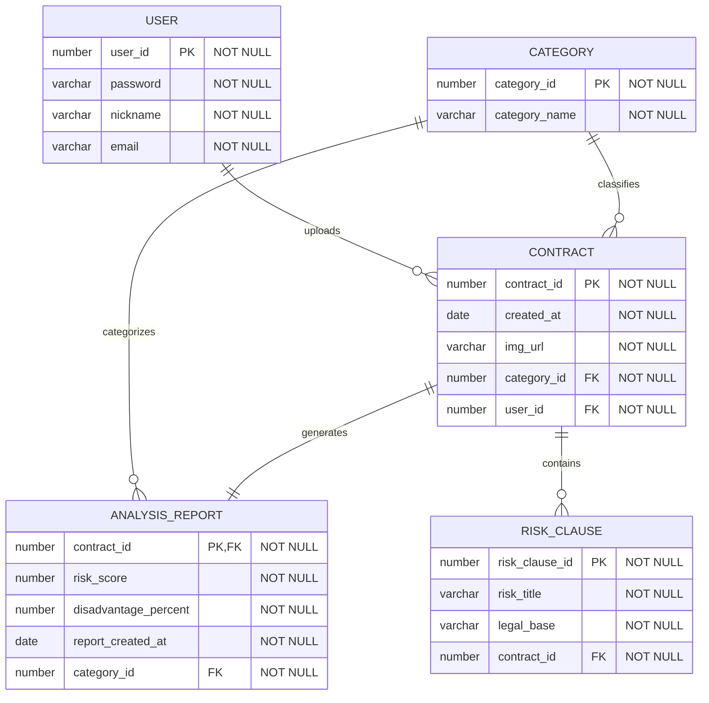

\<div align="center"\>

# ⚖️ AI-Lawyer (올라운드 법률 에이전트)

**"어렵고 복잡한 모든 종류의 계약서 분석부터, 실시간 사후 감시, 전문가 매칭까지 원스톱 해결"**

[](https://nextjs.org/)
[](https://spring.io/projects/spring-boot)
[](https://deepmind.google/technologies/gemini/)
[](https://supabase.com/)
[](https://www.google.com/search?q=LICENSE)

\</div\>

-----

## 🌟 서비스 소개 (Overview)

[cite_start]**AI-Lawyer**는 법률 지식이 부족하여 계약 체결 전후로 불안감을 느끼는 개인 및 사업자를 위한 **지능형 법률 리스크 관리 플랫폼**입니다. [cite: 113] [cite_start]단순히 문서를 분석하는 것에 그치지 않고, 사용자의 권익을 보호하기 위한 협상 지원과 사후 모니터링까지 책임집니다. [cite: 117, 120]

  - **미션**: "모두가 법적 평등을 누릴 수 있는 세상을 향하여"
  - **핵심 가치**: 리스크 사전 예방 | 전 과정 모니터링 | [cite_start]집단지성 연대 [cite: 116, 121]

-----

## 👥 팀원 소개 (Team Members)

[cite_start]본 프로젝트는 6명의 풀스택 개발자가 협업하여 구축하였습니다. [cite: 4]

| 이름 | 역할 | 주요 기여 내용 |
| :--- | :--- | :--- |
| **유재복** | PM | [cite_start]프로젝트 총괄 및 일정 관리, DB 설계, Netlify 및 Koyeb 배포 [cite: 26, 44, 45, 495] |
| **탁유제** | PL | [cite_start]Stitch UI/UX 설계 가이드 수립, DB 설계, AI 에이전트 지시서 최적화 [cite: 27, 48, 50, 499] |
| **강민재** | Dev | [cite_start]Spring Security 및 JWT 기반 회원가입/로그인 기능 구현 [cite: 28, 54, 55] |
| **박시원** | Dev | [cite_start]AI 기반 2가지 계약서 동시 분석 및 정밀 리포트 생성 기능 개발 [cite: 29, 56, 57, 58, 60] |
| **이진영** | Dev | [cite_start]계약 마감 기한 알림 시스템 구축, 유형별 분석 데이터 시각화 대시보드 개발 [cite: 30, 52, 53] |
| **문광명** | Dev | [cite_start]AI 문서 분석 엔진(RAG 챗봇) 구현, 분석 결과 리포트 및 DB 설계 [cite: 31, 38, 42, 61] |

-----

## 🗄 데이터베이스 설계 (ERD)

[cite_start]데이터의 일관성과 효율적인 AI 분석 리포트 생성을 위해 설계된 ERD입니다. [cite: 189]



[cite_start][cite: 192, 196, 213, 218, 220]

-----

## ✨ 핵심 기능 (Core Features)

### 🛡️ 신뢰와 안전 (Security & Privacy)

  - **개인정보 비식별화**: [cite_start]AI 분석 전 자동 마스킹 처리를 통해 민감 정보를 보호합니다. [cite: 82, 91]
  - **휘발성 시스템**: [cite_start]분석 즉시 데이터를 영구 파기하여 유출을 방지합니다. [cite: 82]

### 🔍 똑똑한 분석 (Smart AI Parser)

  - **문서 자동 식별**: [cite_start]계약서가 아닌 문서를 업로드 시 즉시 판별하여 안내합니다. [cite: 105, 106]
  - **다국어 지원**: [cite_start]이미지 및 PDF 내 다국어 계약서를 판별하여 한국어 분석 결과를 제공합니다. [cite: 105, 106]

### 📊 인사이트 리포트 (Intelligent Insight)

  - **위험도 스코어링**: [cite_start]계약서의 위험도 점수, 불리함 지수 등 통계를 시각화하여 제공합니다. [cite: 87, 389, 391]
  - **협상 가이드**: [cite_start]독소 조항에 대한 상세 근거와 추천 협상 포인트(스크립트)를 자동 생성합니다. [cite: 120, 306, 308]
  - **Interactive Q\&A**: [cite_start]분석 결과를 바탕으로 AI 상담사와 실시간 챗봇 상담이 가능합니다. [cite: 110, 118, 282]

### 🚀 사후 관리 (Post-Contract Management)

  - **마감 알림**: [cite_start]계약서 내 마감일을 식별하여 현재 날짜 기준 10일 이내일 경우 알림을 제공합니다. [cite: 52, 94, 335]
  - **비교 분석**: [cite_start]두 개의 계약서를 업로드하여 유리한 조건을 즉시 비교할 수 있는 대조 엔진을 제공합니다. [cite: 92, 341, 358]

-----

## 🛠 기술 스택 (Tech Stack)

### Frontend

  - [cite_start]**Framework**: Next.js 15 (App Router), React 19 [cite: 150]
  - [cite_start]**Styling**: Tailwind CSS 4 [cite: 150]
  - [cite_start]**Visualization**: Recharts (Risk Scoring Chart) [cite: 423]

### Backend

  - [cite_start]**Framework**: Spring Boot 3.5, Java 17 [cite: 131, 153]
  - [cite_start]**Database**: PostgreSQL (Supabase), MyBatis [cite: 155]
  - [cite_start]**AI Integration**: LangChain4j (Gemini, Groq/Llama 3.3) [cite: 144, 173, 253]

### Infrastructure / CI/CD

  - [cite_start]**Deployment**: Netlify (Frontend), Koyeb (Backend) [cite: 136, 137]
  - [cite_start]**Security**: JJWT (Spring Security Integration) [cite: 131, 132]

-----

## 🚀 기술적 난제 및 해결 (Technical Challenges)

[cite_start]프로젝트 개발 과정에서 발생한 병목 현상을 팀 차원에서 논리적으로 해결한 기록입니다. [cite: 455, 468]

### 1\. AI 협업 컨벤션 불일치 문제

  * [cite_start]**문제**: 기능별 풀스택 개발 시 AI가 생성하는 코드 패턴 및 네이밍 컨벤션의 비일관성으로 구조적 통일성 저해 우려 발생 [cite: 449, 451, 456]
  * [cite_start]**해결**: Root 디렉토리에 `.ai-rules.md` 파일을 추가하여 팀 단위 컨벤션을 정의하고 AI가 이를 준수하여 응답하도록 설정함 [cite: 457, 458]

### 2\. AI 생성 코드의 대소문자 미준수 (DB 연동 오류)

  * [cite_start]**문제**: 이미지 기반 코드 구조화 요청 시 AI가 대소문자를 간과하여 Supabase 테이블명(`User`)과 엔티티(`user`)가 불일치하는 현상 발생 [cite: 452, 459, 460]
  * [cite_start]**해결**: `entity-guide.md` 워크플로우를 정의하여 AI에게 명시적인 대소문자 점검 프로세스를 요청해 런타임 에러 사전 차단 [cite: 461, 462]

### 3\. 이기종 플랫폼 간 CORS 통신 장애

  * [cite_start]**문제**: Netlify와 Koyeb 플랫폼 간 Origin 차이로 인한 브라우저의 동일 출처 정책(SOP)에 따른 API 요청 차단 발생 [cite: 465, 469, 472]
  * [cite_start]**해결**: 백엔드 `SecurityConfig`의 `setAllowedOrigins` 설정을 통해 실제 배포 도메인을 허용하여 안정적인 보안 통신 환경 구축 [cite: 473, 474, 477]

-----

## 🏗 시스템 아키텍처 (Architecture)

[cite_start]Spring Boot 3.5 기반의 기능별 모듈화(인증, AI 분석, 검색, 알림)를 통해 유지보수성을 극대화한 아키텍처입니다. [cite: 153]

-----

## 🚀 시작하기 (Getting Started)

### 사전 요구 사항 (Prerequisites)

  - [Node.js 20+](https://nodejs.org/)
  - [Java 17+](https://adoptium.net/ko/)
  - [Gemini API Key](https://aistudio.google.com/app/apikey)
  - [Supabase Account](https://supabase.com/)

### 프로젝트 구조

  - `frontend/`: Next.js 기반 UI 어플리케이션
  - `backend/`: Spring Boot 기반 API 서버

### 백엔드 설정 (Backend Setup)

1.  `backend/src/main/resources/.env` 파일을 만들고 아래 내용을 설정합니다.
    ```bash
    DB_URL=jdbc:postgresql://your-supabase-url:5432/postgres
    DB_USERNAME=your-username
    DB_PASSWORD=your-password
    GEMINI_API_KEY=your-gemini-key
    JWT_SECRET=your-jwt-secret
    ```
2.  서버 실행:
    ```bash
    cd backend
    ./gradlew bootRun
    ```

### 프론트엔드 설정 (Frontend Setup)

1.  `frontend/.env.local` 파일을 만들고 API 경로를 설정합니다.
    ```bash
    NEXT_PUBLIC_API_URL=http://localhost:8080
    ```
2.  의존성 설치 및 실행:
    ```bash
    cd frontend
    npm install
    npm run dev
    ```

-----

## 📄 라이선스 (License)

본 프로젝트는 [MIT License](https://www.google.com/search?q=LICENSE)에 따라 배포됩니다.

-----

\<div align="center"\>
\<b\>Representative:\</b\> ashfortune (Human13th Team)  
\<b\>Contact:\</b\> support@ai-lawyer.com
\</div\>

-----
