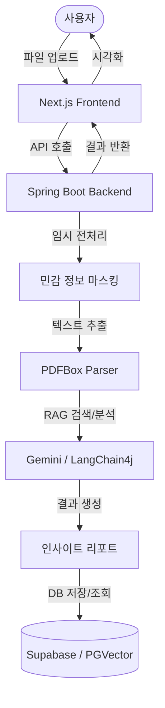

<div align="center">
  

  # ⚖️ AI-Lawyer (올라운드 법률 에이전트)

  **"어렵고 복잡한 모든 종류의 계약서 분석부터, 실시간 사후 감시, 전문가 매칭까지 원스톱 해결"**

  [](https://nextjs.org/)
  [](https://spring.io/projects/spring-boot)
  [](https://deepmind.google/technologies/gemini/)
  [](https://supabase.com/)
  [](LICENSE)
</div>

---

## 🌟 서비스 소개 (Overview)

**AI-Lawyer**는 법률 지식이 부족하여 계약 체결 전후로 불안감을 느끼는 개인 및 사업자를 위한 **지능형 법률 리스크 관리 플랫폼**입니다. 단순히 문서를 분석하는 것에 그치지 않고, 사용자의 권익을 보호하기 위한 협상 지원과 사후 모니터링까지 책임집니다.

- **미션**: "모두가 법적 평등을 누릴 수 있는 세상을 향하여"
- **핵심 가치**: 리스크 사전 예방 | 전 과정 모니터링 | 집단지성 연대

---

## ✨ 핵심 기능 (Core Features)

### 🛡️ 신뢰와 안전 (Security & Privacy)
- **개인정보 비식별화**: AI 분석 전 자동 마스킹 처리를 통해 민감 정보 보호
- **휘발성 시스템**: 분석 즉시 데이터를 영구 파기하여 유출 방지 (UI 파쇄기 애니메이션 등 적용)

### 🔍 똑똑한 분석 (Smart AI Parser)
- **문서 자동 식별**: 계약서가 아닌 문서(자소서 등) 업로드 시 즉시 판별 및 안내
- **다국어 지원**: 영문, 중문 등 다국어 계약서도 고도화된 AI가 한글로 분석 및 해설

### 📊 인사이트 리포트 (Intelligent Insight)
- **표준 약관 비교**: 공정위 등 표준 약관과 대조하여 위험도 도출 (0~100점 스코어링)
- **협상 스크립트**: 독소조항 수정 요청을 위한 "전문적이고 정중한" 문구 자동 생성
- **Interactive Q&A**: 분석 결과 기반의 RAG 챗봇을 통해 궁금한 점 즉시 확인

### 🚀 사후 관리 및 공유 (Post-Contract & Shared Insight)
- **가디언 (사후 감시)**: 리스크 발생 조건(기한 등)을 AI가 기억하여 사전 알림 제공
- **독소조항 블랙리스트**: 특정 기업의 불공정 조항 데이터를 익명 수집/공유하여 2차 피해 방지
- **전문가 브릿지**: 중대 서류 판정 시 변호사/노무사 다이렉트 매칭 지원

---

## 🛠 기술 스택 (Tech Stack)

### Frontend
- **Framework**: Next.js 15 (App Router), React 19
- **Styling**: Tailwind CSS 4, Lucid React (Icons)
- **Visualization**: Recharts (Risk Scoring Chart)
- **State Management**: React Server Components & Client Hooks

### Backend
- **Framework**: Spring Boot 3.5, Java 17
- **Database**: PostgreSQL (Supabase), MyBatis
- **AI Integration**: LangChain4j (Gemini, OpenAI, PGVector)
- **Document Processing**: Apache PDFBox

### Infrastructure / Deployment
- **Storage**: Supabase Storage
- **Security**: JJWT (Spring Security Integration)

---

## 🏗 시스템 아키텍처 (Architecture)



---

## 🚀 시작하기 (Getting Started)

### 사전 요구 사항 (Prerequisites)
- [Node.js 20+](https://nodejs.org/)
- [Java 17+](https://adoptium.net/ko/)
- [Gemini API Key](https://aistudio.google.com/app/apikey)
- [Supabase Account](https://supabase.com/)

### 프로젝트 구조
- `frontend/`: Next.js 기반 UI 어플리케이션
- `backend/`: Spring Boot 기반 API 서버

### 백엔드 설정 (Backend Setup)
1. `backend/src/main/resources/.env` 파일을 만들고 아래 내용을 설정합니다.
   ```bash
   DB_URL=jdbc:postgresql://your-supabase-url:5432/postgres
   DB_USERNAME=your-username
   DB_PASSWORD=your-password
   GEMINI_API_KEY=your-gemini-key
   JWT_SECRET=your-jwt-secret
   ```
2. 서버 실행:
   ```bash
   cd backend
   ./gradlew bootRun
   ```

### 프론트엔드 설정 (Frontend Setup)
1. `frontend/.env.local` 파일을 만들고 API 경로를 설정합니다.
   ```bash
   NEXT_PUBLIC_API_URL=http://localhost:8080
   ```
2. 의존성 설치 및 실행:
   ```bash
   cd frontend
   npm install
   npm run dev
   ```

---

## 📄 라이선스 (License)

본 프로젝트는 [MIT License](LICENSE)에 따라 배포됩니다.

---

<div align="center">
  <b>Representative:</b> ashfortune (Human13th Team)  
  <b>Contact:</b> support@ai-lawyer.com
</div>
