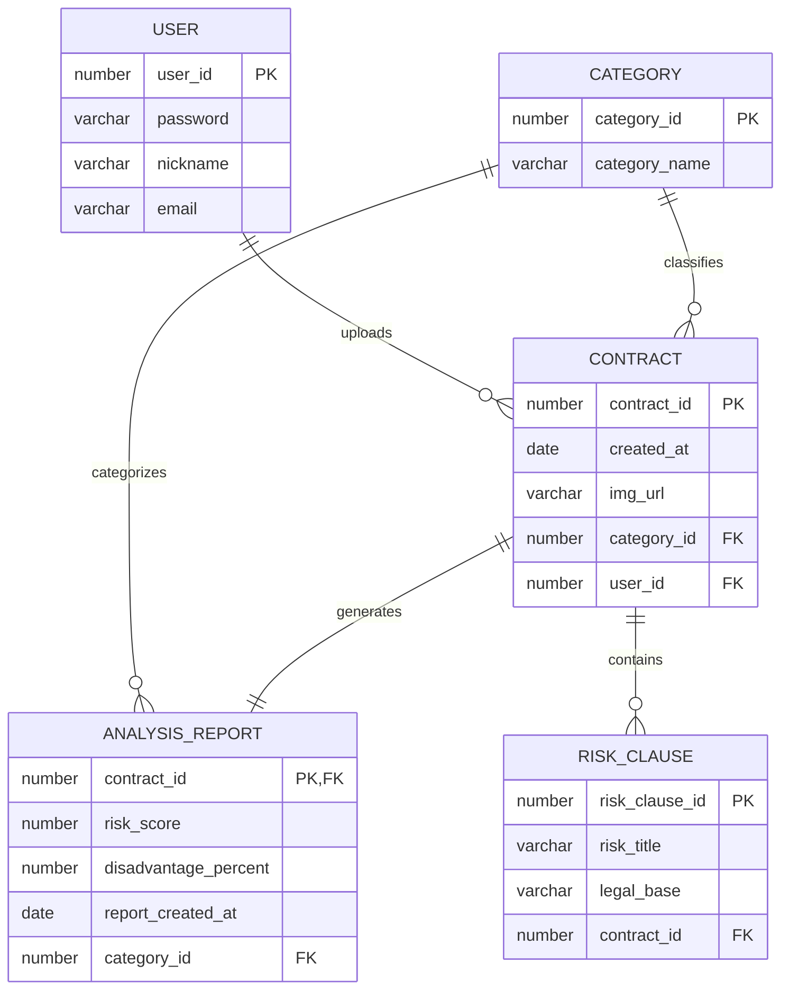
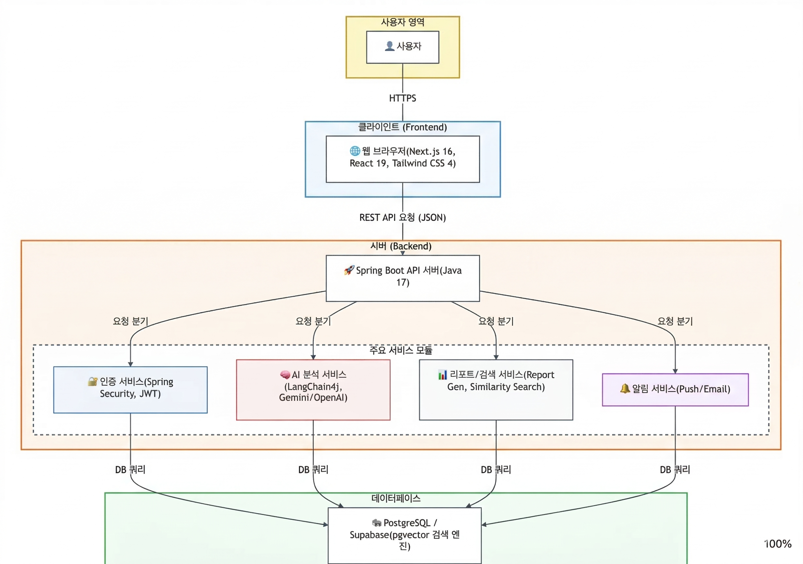

<div align="center">

  # ⚖️ AI-Lawyer (올라운드 법률 에이전트)

  **"어렵고 복잡한 모든 종류의 계약서 분석부터, 실시간 사후 감시, 전문가 매칭까지 원스톱 해결"**

  [](https://nextjs.org/)
  [](https://spring.io/projects/spring-boot)
  [](https://deepmind.google/technologies/gemini/)
  [](https://supabase.com/)
  [](LICENSE)
</div>

---

## 🌟 서비스 소개 (Overview)

**AI-Lawyer**는 법률 지식이 부족하여 계약 체결 전후로 불안감을 느끼는 개인 및 사업자를 위한 **지능형 법률 리스크 관리 플랫폼**입니다. 단순히 문서를 분석하는 것에 그치지 않고, 사용자의 권익을 보호하기 위한 협상 지원과 사후 모니터링까지 책임집니다.

- **미션**: "모두가 법적 평등을 누릴 수 있는 세상을 향하여"
- **핵심 가치**: 리스크 사전 예방 | 전 과정 모니터링 | 집단지성 연대

---

## 👥 팀원 소개 (Team Members)

본 프로젝트는 **6명의 풀스택 개발자**가 협업하여 구축하였습니다.

| 이름 | 역할 | 주요 기여 내용 |
| :--- | :--- | :--- |
| **유재복** | **PM** | 문서분석, 분석결과리포트, RAG 기반 챗봇, DB 설계, 배포 |
| **탁유제** | **PL** | 계약서 전체/유형별 대시보드, Stitch UI/UX 설계, DB 설계, PPT 제작 |
| **강민재** | **Dev** | 계약서 내 마감기한 추출 시 알림 시스템 구축 |
| **박시원** | **Dev** | 회원가입 기능 구현 및 보안 최적화 |
| **이진영** | **Dev** | 로그인 기능 구현 및 인증 프로세스 관리 |
| **문광명** | **Dev** | AI 기반 2가지 계약서 동시 분석 및 비교 결과 리포트 개발, DB 설계 |

---

## 🗄️ 데이터베이스 설계 (ERD)

데이터의 일관성과 효율적인 AI 분석 리포트 생성을 위해 설계된 구조입니다.



---

## ✨ 핵심 기능 (Core Features)

### 🛡️ 신뢰와 안전 (Security & Privacy)
- **개인정보 비식별화**: AI 분석 전 자동 마스킹 처리를 통해 민감 정보 보호
- **휘발성 시스템**: 분석 즉시 데이터를 영구 파기하여 유출 방지 (UI 파쇄기 애니메이션 등 적용)

### 🔍 똑똑한 분석 (Smart AI Parser)
- **문서 자동 식별**: 계약서가 아닌 문서(자소서 등) 업로드 시 즉시 판별 및 안내
- **다국어 지원**: 영문, 중문 등 다국어 계약서도 고도화된 AI가 한글로 분석 및 해설

### 📊 인사이트 리포트 (Intelligent Insight)
- **표준 약관 비교**: 공정위 등 표준 약관과 대조하여 위험도 도출 (0~100점 스코어링)
- **협상 스크립트**: 독소조항 수정 요청을 위한 "전문적이고 정중한" 문구 자동 생성
- **Interactive Q&A**: 분석 결과 기반의 RAG 챗봇을 통해 궁금한 점 즉시 확인

### 🚀 사후 관리 및 비교 (Post-Contract & Comparison)
- **마감 알림**: 계약서 내 마감일을 식별하여 10일 이내일 경우 자동 푸시 알림 제공
- **비교 분석**: 두 개의 계약서를 업로드하여 유리한 조건을 한눈에 비교 가능
- **전문가 브릿지**: 중대 서류 판정 시 변호사/노무사 다이렉트 매칭 지원

---

## 🛠 기술 스택 (Tech Stack)

### Frontend
- **Framework**: Next.js 15 (App Router), React 19
- **Styling**: Tailwind CSS 4, Lucid React (Icons)
- **Visualization**: Recharts (Risk Scoring Chart)
- **State Management**: React Server Components & Client Hooks

### Backend
- **Framework**: Spring Boot 3.5, Java 17
- **Database**: PostgreSQL (Supabase), MyBatis
- **AI Integration**: LangChain4j (Gemini, OpenAI, PGVector)
- **Document Processing**: Apache PDFBox

### Infrastructure / Deployment & CI/CD
- **Frontend**: [Netlify](https://www.netlify.com/) (GitHub 연동 자동 배포 및 호스팅)
- **Backend**: [Koyeb](https://www.koyeb.com/) (Dockerfile 기반 서버 배포 및 CI/CD)
- **Storage**: Supabase Storage
- **Security**: JJWT (Spring Security Integration)

---

## 🏗 시스템 아키텍처 (Architecture)



---

## 🚀 시작하기 (Getting Started)

### 사전 요구 사항 (Prerequisites)
- [Node.js 20+](https://nodejs.org/)
- [Java 17+](https://adoptium.net/ko/)
- [Gemini API Key](https://aistudio.google.com/app/apikey)
- [Supabase Account](https://supabase.com/)

### 백엔드 설정 (Backend Setup)
1. `backend/src/main/resources/.env` 파일 생성 및 설정:
   ```bash
   DB_URL=jdbc:postgresql://your-supabase-url:5432/postgres
   DB_USERNAME=your-username
   DB_PASSWORD=your-password
   GEMINI_API_KEY=your-gemini-key
   JWT_SECRET=your-jwt-secret
   ```
2. 서버 실행:
   ```bash
   cd backend
   ./gradlew bootRun
   ```

### 프론트엔드 설정 (Frontend Setup)
1. `frontend/.env.local` 파일 구성:
   ```bash
   NEXT_PUBLIC_API_URL=http://localhost:8080
   ```
2. 의존성 설치 및 실행:
   ```bash
   cd frontend
   npm install
   npm run dev
   ```

---

## 🛠️ 기술적 난제 및 해결 (Technical Challenges)

- **AI 협업 컨벤션 불일치**: `.ai-rules.md`를 도입하여 팀 단위 컨벤션에 맞춘 코드 생성 제어
- **DB 대소문자 매핑 이슈**: `entity-guide.md` 워크플로우를 통해 Supabase와 엔티티 간 불일치 해결
- **플랫폼 간 CORS 이슈**: `SecurityConfig` 설정을 통해 Netlify-Koyeb 간 통신 보장

---

## 📄 라이선스 (License)

본 프로젝트는 [MIT License](LICENSE)에 따라 배포됩니다.

---

<div align="center">
  <b>Representative:</b> ashfortune (Human13th Team) | <b>Contact:</b> support@ai-lawyer.com
</div>